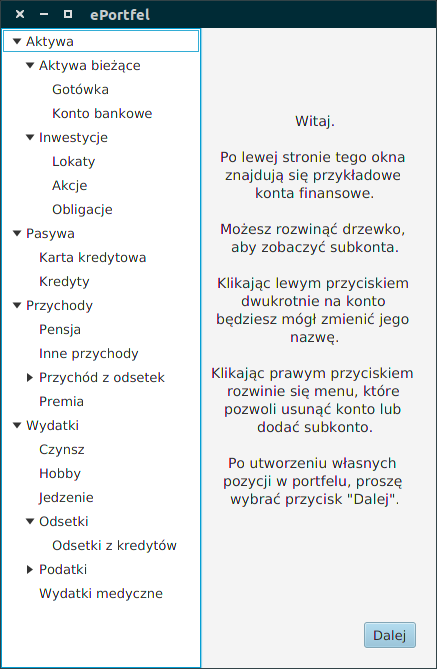
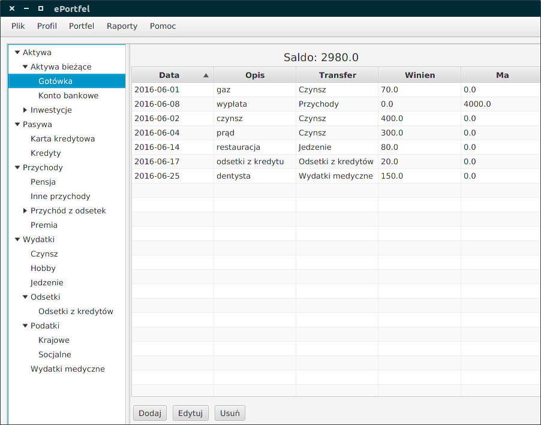
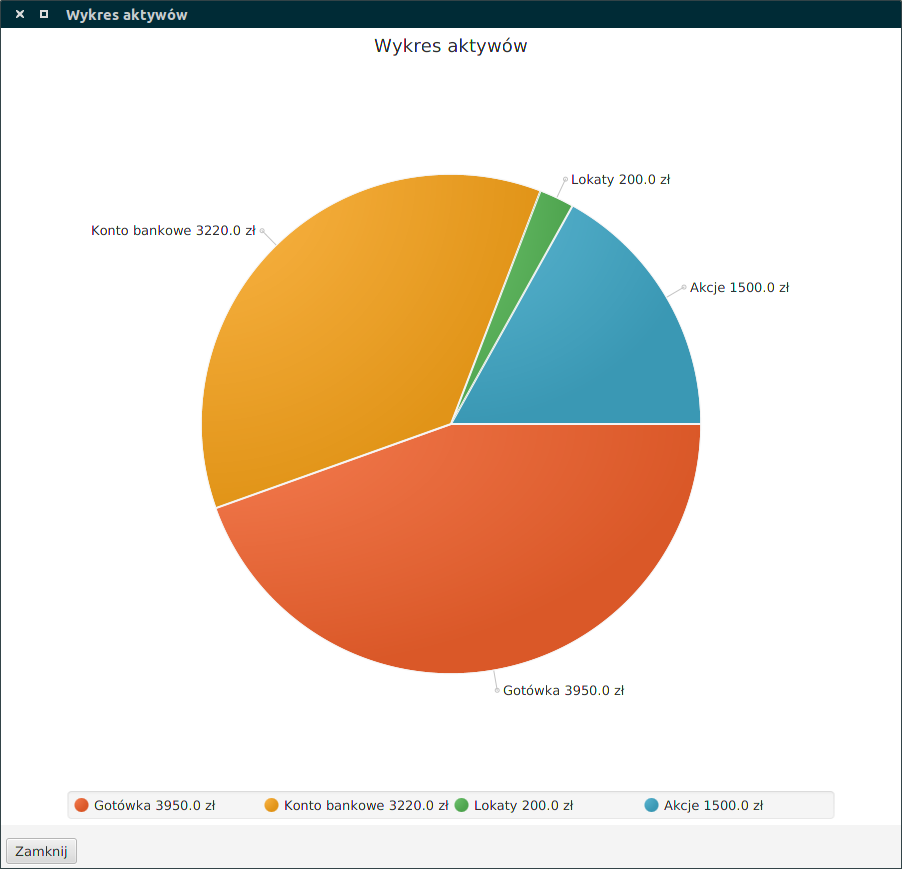

# e-Wallet (e-Portfel) 
The electronic wallet was created using javaFX technology. Use it to manage
your personal accounts. The application implements a [Double-entry bookkeeping system](https://en.wikipedia.org/wiki/Double-entry_bookkeeping_system). 
The program is cross-platform software, you must have installed [java 8](https://java.com/pl/download/) or above to run it. 

### How to use
First create your profile and specify where your data base will be save. You
can make modifications to default accounts or add your own. All of the accounts can be one of 4 types:
- Asset
- Liability	
- Income 
- Expense

When you do operations in entry from one account, program will add entry on a coresponding account.  For instance, recording earnings of $100 would require making two entries: a debit entry of $100 to an account named "Cash" and a credit entry of $100 to an account named "Revenue."
You can create your profile and have a access to it after you log in. You can create reports to reviews your expense and income. 

Features:
- creating a wallet
- creating a user profile
- logging in to a user profile
- managing wallets
- saving in to a database
- creating reports

### Used technology
Java 8, JavaFX, Scene Builder, SQLite, JDBC  
The application was written in MVC pattern.

### Screenshots

  

  

  
